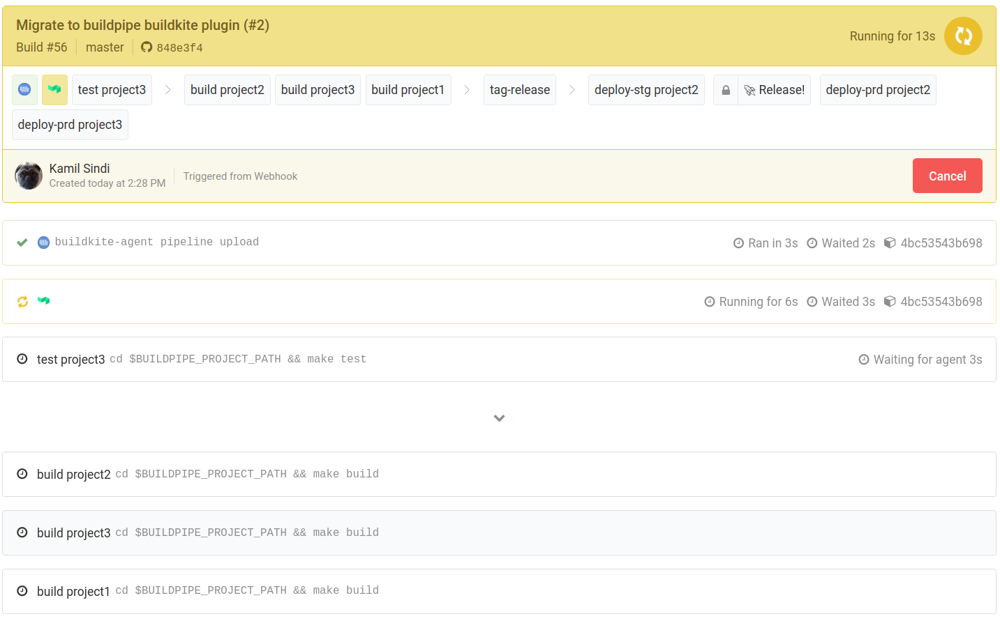

Buildpipe
=========

A Buildkite plugin to dynamically generate pipelines. Especially useful
for monorepos where you want to create dependencies between projects.

Example
-------



### initial\_pipeline.yml

```yaml
steps:
  - label: ":buildkite:"
    plugins:
      - jwplayer/buildpipe#v0.9.1:
          dynamic_pipeline: dynamic_pipeline.yml
```

### dynamic\_pipeline.yml

```yaml
projects:
 - label: project1
   path: project1/  # changes in this directory will trigger steps for project1
   skip:
     - deploy*  # skip steps with label matching deploy* (e.g. deploy-prd)
     - test
 - label: project2
   skip: test
   path:
      - project2/
      - project1  # you can trigger a project using multiple paths
 - label: project3
   skip:
     - deploy-stg
   path: project3/somedir/  # subpaths can also be triggered
steps:  # the same schema as regular buildkite pipeline steps
  - label: test
    env:
      BUILDPIPE_SCOPE: project  # this variable ensures a test step is generated for each project
    command:
      - cd $$BUILDPIPE_PROJECT_PATH  # BUILDPIPE_PROJECT_PATH is set by buildpipe
      - make test
  - wait
  - label: build
    branches: "master"
    env:
      BUILDPIPE_SCOPE: project
    command:
      - cd $$BUILDPIPE_PROJECT_PATH
      - make build
      - make publish-image
    agents:
      - queue=build
  - wait
  - label: tag
    branches: "master"
    command:
      - make tag-release
  - wait
  - label: deploy-stg
    branches: "master"
    concurrency: 1
    concurrency_group: deploy-stg
    env:
      BUILDPIPE_SCOPE: project
    command:
      - cd $$BUILDPIPE_PROJECT_PATH
      - make deploy-staging
  - wait
  - block: ":rocket: Release!"
    branches: "master"
  - wait
  - label: deploy-prd
    branches: "master"
    concurrency: 1
    concurrency_group: deploy-prd
    env:
      BUILDPIPE_SCOPE: project
    command:
      - cd $$BUILDPIPE_PROJECT_PATH
      - make deploy-prod
```

The above pipelines specify the following:

-   There are three projects to track in the repository.
-   The env variable `BUILDPIPE_SCOPE: project` tells buildpipe to
    generate a step for each project if that project changed.
-   The `skip` option will skip any step label matching `deploy*`.
-   The env variable `BUILDPIPE_PROJECT_PATH` is created by buildpipe as
    the project\'s path. If multiple paths are specified for a project,
    it\'s the first path.

### Full working example

For a full working example, check out [Buildkite Monorepo Example](https://github.com/ksindi/buildkite-monorepo-example).

Configuration
-------------

### Plugin

| Option           | Required | Type   | Default | Description
| ---------------- | -------- | ------ | ------- | -------------------------------------------------- |
| default_branch   | No       | string | master  | Default branch of repository |
| diff_pr          | No       | string |         | Override command for non-default branch (see below for a better explanation of the defaults) |
| diff_default     | No       | string |         | Override command for default branch (see below for a better explanation of the defaults) |
| dynamic_pipeline | Yes      | string |         | The name including the path to the pipeline that contains all the actual steps |
| log_level        | No       | string | INFO    | The Level of logging to be used by the python script underneath; pass DEBUG for verbose logging if errors occur |

### Project schema

| Option | Required | Type   | Default | Description                           |
| ------ | -------- | ------ | ------- | ------------------------------------- |
| label  | Yes      | string |         | Project label                         |
| path   | Yes      | array  |         | The path(s) that specify changes to a project |
| skip   | No       | array  |         | Exclude steps that have labels that match the rule |

Other useful things to note:

-   Option `skip` make use of Unix shell-style wildcards (Look at
    .gitignore files for inspiration)
-   If multiple paths are specified, the environment variable
    `BUILDPIPE_PROJECT_PATH` will be the first path.

`diff_` commands
----------------

Depending on your [merge
strategy](https://help.github.com/en/github/administering-a-repository/about-merge-methods-on-github),
you might need to use different diff command.

Buildpipe assumes you are using a merge strategy on the default branch, which is assumed to be `master`.

The command for the non-default branch (e.g. when you have a PR up) is:
```bash
git log --name-only --no-merges --pretty=format: origin..HEAD
```

The command for the default branch you merge to is currently:
```bash
git log -m -1 --name-only --pretty=format: $BUILDKITE_COMMIT
```

Requirements
------------

Only `curl` is required to download the binary.

Installing buildpipe
--------------------

You can also install buildpipe in the agent bootstrap script:

```bash
curl -Lf -o /usr/local/bin/buildpipe https://github.com/jwplayer/buildpipe-buildkite-plugin/releases/download/v${BUILDPIPE_VERSION}/buildpipe-linux \
  && chmod +x /usr/local/bin/buildpipe
```

Your initial pipeline would need to pass the options as environment variables with prefix `BUILDKITE_PLUGIN_BUILDPIPE_`. For example:

```yml
steps:
  - label: "buildpipe"
    command: buildpipe
    env:
      BUILDKITE_PLUGIN_BUILDPIPE_DYNAMIC_PIPELINE: path/to/dynamic_pipeline.yml
      BUILDKITE_PLUGIN_BUILDPIPE_LOG_LEVEL: debug
```

Troubleshooting
---------------

### Buildpipe is incorrectly showing project as changed

Buildkite doesn\'t by default do clean checkouts. To enable clean
checkouts set the `BUILDKITE_CLEAN_CHECKOUT` [environment variable](https://buildkite.com/docs/pipelines/environment-variables). An
example is to modify the pre-checkout hook,
`.buildkite/hooks/pre-checkout`:

```bash
#!/bin/bash
set -euo pipefail

echo '--- :house_with_garden: Setting up pre-checkout'

export BUILDKITE_CLEAN_CHECKOUT="true"
```

Testing
-------

```bash
make test
```

License
-------

Apache v2
